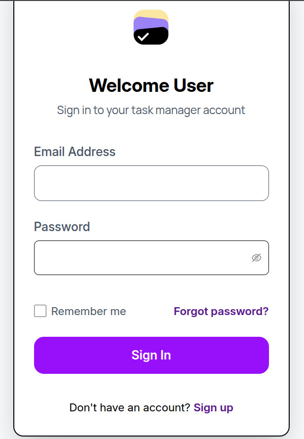
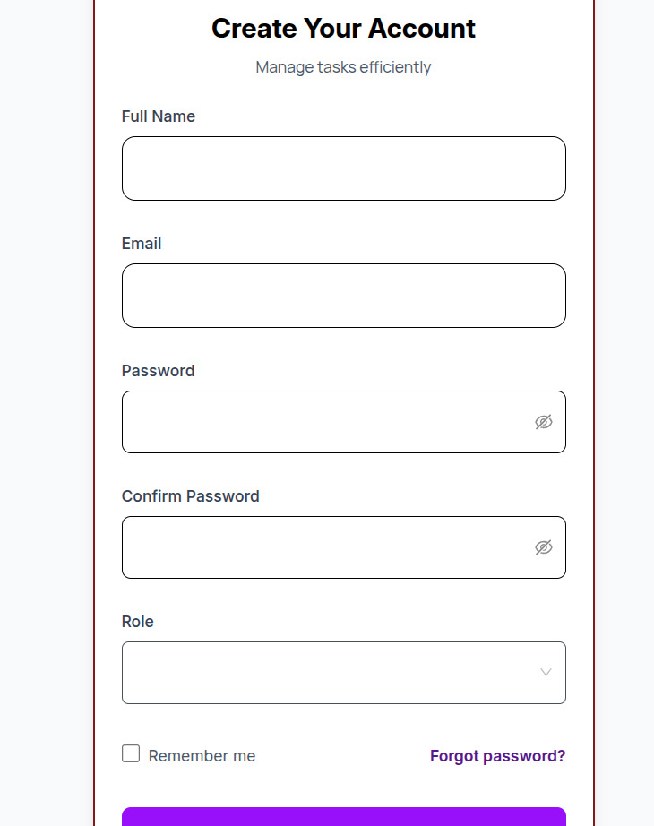
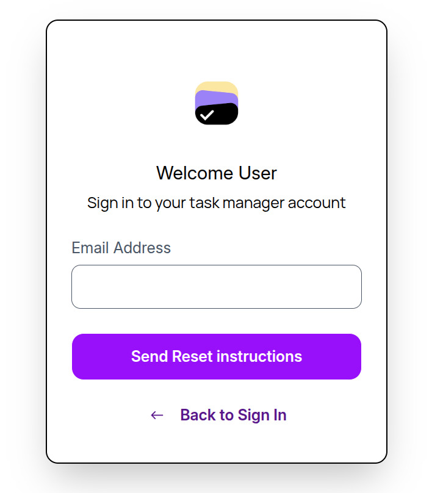
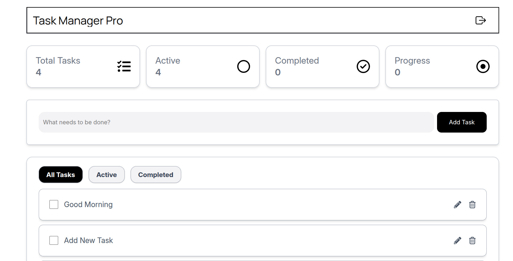
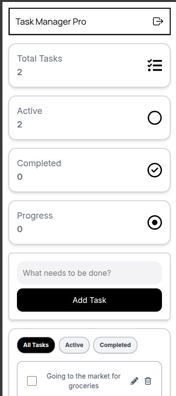

# Task Manager App

A full-stack MERN (MongoDB, Express, React, Node.js) application that allows users to manage tasks efficiently with secure JWT authentication and Typescript. Users can create, edit, update, and delete tasks, and the app features responsive design, and a clean UI.

## Live Demo
[Task Manager Live](https://task-manager-pro-eosin.vercel.app)

## Screenshots
  
  
 
 


## Features
- User authentication with JWT
- Create, edit, update, and delete tasks
- View tasks in a responsive dashboard
- Task Status Dashboard
- Secure API endpoints
- Mobile-friendly UI

## Tech Stack
**Frontend:**  
- React  
- Tailwind CSS  
- Axios  
- Typescript

**Backend:**  
- Node.js  
- Express.js  
- MongoDB (Mongoose)  
- JWT for authentication  
- Cors  
- Joi

**Deployment:**  
- Frontend: Vercel  
- Backend: Render


## Getting Started

### 1. Clone the repository
```bash
git clone https://github.com/Ghising-Palsang/Task-Manager-Pro.git
cd task-manager-pro